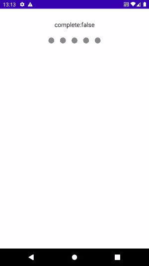
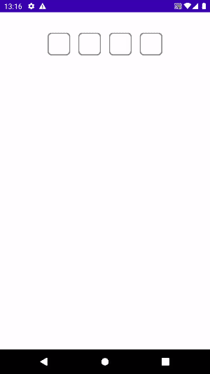
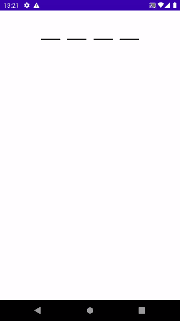
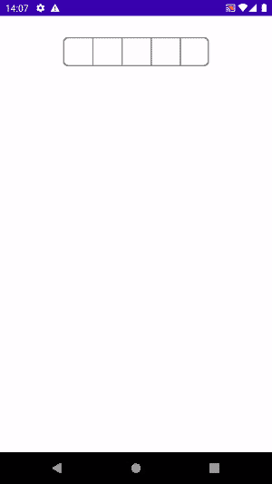

# RatingBar for Jetpack Compose
[](https://jitpack.io/#gevorg89/RatingBar)
> PinView for Jetpack Compose!

### Implementation
from JitPack:
```gradle
allprojects {
    repositories {
        ...
        maven { url 'https://jitpack.io' }
    }
}

dependencies {
    implementation 'com.github.gevorg89:pinview:LATEST_VERSION'
}
```

## How use
### Circle animated pin

``` kotlin
@ExperimentalComposeUiApi
@Preview(showBackground = false)
@Composable
fun CirclePreview() {
    var pinDataState by remember { mutableStateOf(PinData(text = "")) }
    Column(
        verticalArrangement = Arrangement.Center,
        horizontalAlignment = Alignment.CenterHorizontally,
        modifier = Modifier
            .padding(top = 32.dp)
            .fillMaxWidth()
    ) {
        Text(
            text = if (pinDataState.text.isNotEmpty()) {
                "Your code:${pinDataState.text}, complete:${pinDataState.complete}"
            } else {
                "complete:${pinDataState.complete}"
            }, fontSize = 17.sp
        )
        PinView(
            modifier = Modifier.padding(top = 16.dp),
            count = 5,
            empty = { EmptyCircle() },
            filled = { _: Char, _: Int -> FilledCircle() }) { pinData ->
            pinDataState = pinData
        }
    }
}


@Composable
private fun EmptyCircle() {
    Circle(content = { }, color = Color.Gray)
}

@Composable
private fun FilledCircle() {
    var animationValue by remember { mutableStateOf(1f) }
    val animationState by animateFloatAsState(
        targetValue = animationValue,
        animationSpec = tween(durationMillis = 100),
        finishedListener = {
            animationValue = 1f
        }
    )
    Circle(
        content = {},
        color = Color.Cyan,
        modifier = Modifier.scale(animationState)
    )
    DisposableEffect(Unit) {
        animationValue = 1.5f
        onDispose {

        }
    }
}

@Composable
private fun Circle(content: @Composable () -> Unit, color: Color, modifier: Modifier = Modifier) {
    Column(
        verticalArrangement = Arrangement.Center,
        horizontalAlignment = Alignment.CenterHorizontally,
        modifier = Modifier
            .size(32.dp)
    ) {
        Column(
            modifier
                .size(16.dp)
                .clip(CircleShape)
                .background(color)
        ) {
            content.invoke()
        }
    }
}
```
### Square pin

``` kotlin
@ExperimentalComposeUiApi
@Preview(showBackground = false)
@Composable
fun SquarePreview() {
    Column(
        verticalArrangement = Arrangement.Center,
        horizontalAlignment = Alignment.CenterHorizontally,
        modifier = Modifier
            .padding(top = 32.dp)
            .fillMaxWidth()
    ) {
        PinView(
            count = 4,
            empty = { EmptyDash() },
            filled = { _: Char, _: Int -> FilledDash() }) { pinData ->
        }
    }
}

@Composable
private fun EmptyDash() {
    Block(content = { }, color = Color.Gray)
}

@Composable
private fun FilledDash() {
    Block(content = {
        Text(text = "*", fontSize = 24.sp)
    }, color = Color.Blue)
}

@Composable
private fun Block(content: @Composable () -> Unit, color: Color) {
    Box(
        contentAlignment = Alignment.Center,
        modifier = Modifier
            .padding(8.dp)
            .border(color = color, width = 2.dp, shape = RoundedCornerShape(8.dp))
            .size(44.dp)
    ) {
        content.invoke()
    }
}
```

### Dash center pin

``` kotlin
@ExperimentalComposeUiApi
@Preview(showBackground = false)
@Composable
fun DashCenterPreview() {
    Column(
        verticalArrangement = Arrangement.Center,
        horizontalAlignment = Alignment.CenterHorizontally,
        modifier = Modifier
            .padding(top = 32.dp)
            .fillMaxWidth()
    ) {
        PinView(
            count = 4,
            empty = { EmptyDash() },
            filled = { char: Char, _: Int ->
                FilledDash(char)
            }) {
        }
    }
}

@Composable
private fun EmptyDash() {
    Block(content = {
        Divider(color = Color.Black, thickness = 2.dp, modifier = Modifier.padding(top = 6.dp))
    })
}

@Composable
private fun FilledDash(char: Char) {
    val text by remember { mutableStateOf(char) }
    Block(content = {
        Text(text = text.toString(), fontSize = 36.sp, textAlign = TextAlign.Center)
    })
}

@Composable
private fun Block(content: @Composable () -> Unit) {
    Box(
        contentAlignment = Alignment.Center,
        modifier = Modifier
            .padding(8.dp)
            .size(44.dp)
    ) {
        content.invoke()
    }
}
```
### Dash bottom pin

``` kotlin
@ExperimentalComposeUiApi
@Preview(showBackground = false)
@Composable
fun DashBottomPreview() {
    Column(
        verticalArrangement = Arrangement.Center,
        horizontalAlignment = Alignment.CenterHorizontally,
        modifier = Modifier
            .padding(top = 32.dp)
            .fillMaxWidth()
    ) {
        PinView(
            count = 4,
            empty = { EmptyDash() },
            filled = { char: Char, _: Int ->
                FilledDash(char)
            }) {
        }
    }
}

@Composable
private fun EmptyDash() {
    Block(content = {
        Column(Modifier.padding(top = 8.dp)) {
            Divider(color = Color.Black, thickness = 2.dp)
        }
    })
}

@Composable
private fun FilledDash(char: Char) {
    val text by remember { mutableStateOf(char) }
    Block(content = {
        Text(text = text.toString(), fontSize = 36.sp, textAlign = TextAlign.Center)
    })
}

@Composable
private fun Block(content: @Composable () -> Unit) {
    Box(
        contentAlignment = Alignment.BottomCenter,
        modifier = Modifier
            .padding(8.dp)
            .size(44.dp)
    ) {
        content.invoke()
    }
}
```
### Left right corner pin

``` kotlin
private const val count = 5
private val radius = 8.dp
private val color = Color.Gray

@ExperimentalComposeUiApi
@Preview(showBackground = false)
@Composable
fun MergedPreview() {
    Column(
        verticalArrangement = Arrangement.Center,
        horizontalAlignment = Alignment.CenterHorizontally,
        modifier = Modifier
            .padding(top = 32.dp)
            .fillMaxWidth()
    ) {
        PinView(
            modifier = Modifier.border(
                color = color,
                width = 2.dp,
                shape = RoundedCornerShape(radius)
            ),
            keyboardType = KeyboardType.Ascii,
            count = count,
            empty = { position: Int ->
                EmptyDash(position)
            },
            filled = { char: Char, position: Int ->
                FilledDash(char, position)
            }) { }
    }
}

@Composable
private fun EmptyDash(position: Int) {
    Block(content = { }, position = position)
}

@Composable
private fun FilledDash(char: Char, position: Int) {
    val text by remember { mutableStateOf(char) }
    Block(
        content = { Text(text = text.toString(), fontSize = 28.sp) },
        position = position
    )
}

@Composable
private fun Block(
    content: @Composable () -> Unit,
    position: Int
) {
    Box(
        contentAlignment = Alignment.Center,
        modifier = Modifier
            .border(if (position > 0) BorderStroke(2.dp, color) else null)
            .size(44.dp)
    ) {
        content.invoke()
    }
}

fun Modifier.border(borderStroke: BorderStroke?) =
    drawBehind {
        borderStroke?.let {
            drawStartBorder(stroke = borderStroke)
        }
    }

private fun DrawScope.drawStartBorder(
    stroke: BorderStroke
) {
    val strokeWidthPx = stroke.width.toPx()
    if (strokeWidthPx == 0f) return
    drawPath(
        Path().apply {
            moveTo(0f, 0f)
            lineTo(strokeWidthPx, 0f)
            val height = size.height
            lineTo(strokeWidthPx, height)
            lineTo(0f, height)
            close()
        },
        brush = stroke.brush
    )
}
```